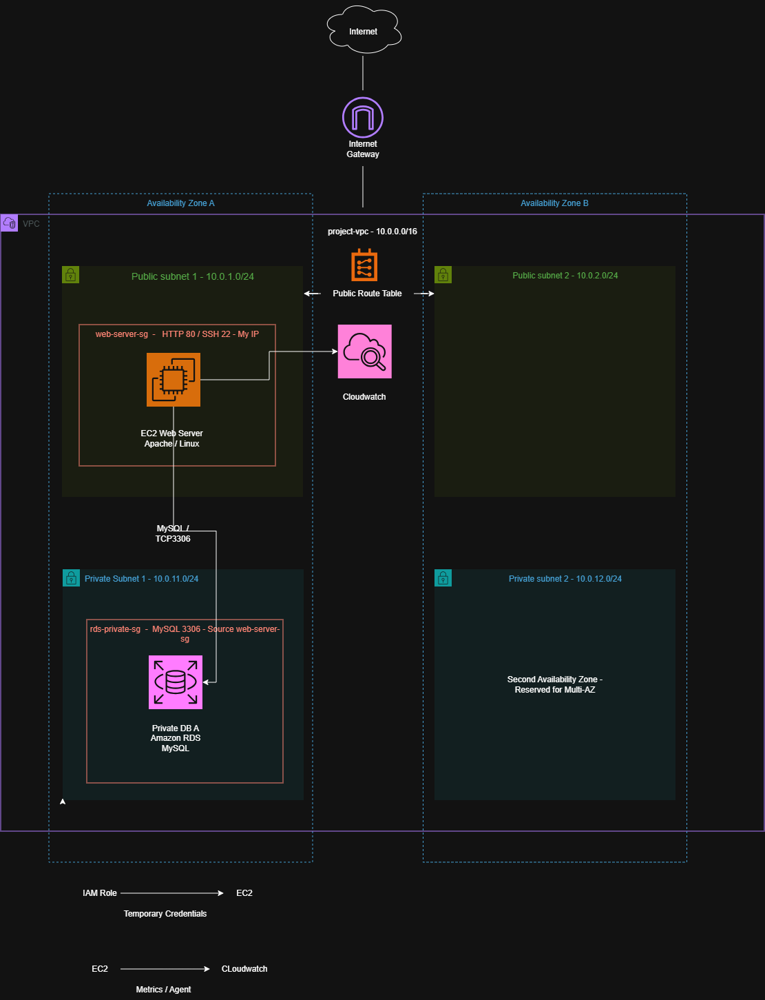

# Deployment Guide

This document describes the deployment process for the AWS Secure Healthcare Infrastructure project.

The environment was built manually through the AWS Management Console to develop hands-on experience with AWS networking, compute, database, IAM, Linux administration, and monitoring.

> This is a portfolio/lab environment. It does not contain real patient information, PHI, or production healthcare data.

---

# 1. Architecture Overview

The environment uses a custom AWS VPC containing public web and private database tiers distributed across two Availability Zones.

The primary application path is:

```text
Internet
    ↓
Internet Gateway
    ↓
Public Subnet
    ↓
Amazon EC2
Apache Web Server
    ↓
MySQL / TCP 3306
    ↓
Private Amazon RDS
```

Supporting services include:

* AWS IAM for EC2 permissions
* Amazon CloudWatch for monitoring
* CloudWatch Agent for guest OS metrics

The complete architecture is documented here:



---

# 2. VPC Creation

A custom VPC was created instead of using the AWS default VPC.

### Configuration

```text
Name: project-vpc
IPv4 CIDR: 10.0.0.0/16
```

The `/16` network provides a large private address space that can be divided into smaller subnets for different infrastructure tiers.

This also makes future expansion possible without redesigning the entire VPC address space.

---

# 3. Subnet Design

Four subnets were created across two Availability Zones.

The architecture separates public-facing resources from the private database tier.

Example layout:

```text
Availability Zone A
├── public-subnet-1
└── private-subnet-1

Availability Zone B
├── public-subnet-2
└── private-subnet-2
```

The deployed CIDRs are documented in the architecture diagram and AWS console screenshots.

The public subnets are intended for resources requiring internet connectivity.

The private database subnets provide isolated placement for Amazon RDS and satisfy the multi-Availability-Zone subnet coverage required by the RDS DB subnet group.

---

# 4. Internet Gateway

An Internet Gateway was created and attached to `project-vpc`.

The Internet Gateway provides a path between the VPC and the public internet.

Attaching an Internet Gateway alone does not make a subnet public. Routing must also be configured appropriately.

---

# 5. Public Route Table

A dedicated public route table was configured for the public subnet tier.

The important routes include:

```text
Destination        Target
10.0.0.0/16        local
0.0.0.0/0          Internet Gateway
```

The public subnets were associated with this route table.

The `0.0.0.0/0` route directs internet-bound IPv4 traffic toward the Internet Gateway.

The private database subnets were intentionally not configured with this public internet route.

---

# 6. EC2 Security Group

A dedicated Security Group was created for the web server.

### Required inbound traffic

```text
HTTP
Protocol: TCP
Port: 80
Source: 0.0.0.0/0
```

This allows users to reach the Apache web server.

Administrative SSH access was restricted:

```text
SSH
Protocol: TCP
Port: 22
Source: Administrator-IP/32
```

SSH was not opened to `0.0.0.0/0`.

---

# 7. EC2 Web Server

An Amazon EC2 instance running Amazon Linux was deployed into Public Subnet 1.

The instance was assigned the web-server Security Group.

After deployment, the instance was accessed using SSH.

Example:

```bash
ssh -i <PRIVATE-KEY> ec2-user@<EC2-PUBLIC-IP>
```

The private key itself is not stored in this repository.

---

# 8. Apache Installation

After connecting to the EC2 instance, Apache was installed.

```bash
sudo dnf install httpd -y
```

Apache was started:

```bash
sudo systemctl start httpd
```

It was also enabled to start automatically after a reboot:

```bash
sudo systemctl enable httpd
```

Service status can be checked with:

```bash
sudo systemctl status httpd
```

The web server was then validated by accessing the EC2 instance over HTTP.

This confirmed:

* EC2 was running.
* Public routing was functioning.
* The Internet Gateway path was working.
* HTTP was allowed through the Security Group.
* Apache was responding.

---

# 9. RDS Security Group

A separate Security Group was created for the database tier.

The RDS Security Group allows:

```text
Type: MySQL/Aurora
Protocol: TCP
Port: 3306
Source: web-server-sg
```

The EC2 web server Security Group is referenced as the source rather than allowing database access from the public internet.

No public MySQL rule was created.

---

# 10. RDS DB Subnet Group

An RDS DB subnet group was created using the two private database subnets.

```text
private-subnet-1
private-subnet-2
```

The subnets are located in separate Availability Zones.

This gives RDS approved private network locations across multiple Availability Zones.

---

# 11. Amazon RDS Deployment

A MySQL Amazon RDS database was deployed.

The project uses a single DB instance deployment rather than a Multi-AZ DB cluster.

Important networking settings included:

```text
VPC:
project-vpc

DB subnet group:
Private database subnets

Public access:
No

Security Group:
rds-private-sg

Database port:
3306
```

The database was therefore not directly reachable from the public internet.

---

# 12. MySQL Client Installation

A MySQL-compatible client was installed on the EC2 web server.

On Amazon Linux 2023:

```bash
sudo dnf install mariadb105 -y
```

The client allows EC2 to communicate with the MySQL server hosted by Amazon RDS.

The EC2 instance itself does not host the MySQL database.

---

# 13. EC2-to-RDS Validation

From the EC2 instance, the RDS endpoint was used to establish a database connection.

```bash
mysql -h <RDS-ENDPOINT> -P 3306 -u <DB-USERNAME> -p
```

The database password is entered interactively and is not included in scripts, documentation, or source control.

Successful authentication verified the network and authentication path between EC2 and RDS.

---

# 14. Database Functionality Test

A test database was created:

```sql
CREATE DATABASE healthcare_portfolio;
```

The database was selected:

```sql
USE healthcare_portfolio;
```

A test table was created:

```sql
CREATE TABLE infrastructure_status (
    id INT AUTO_INCREMENT PRIMARY KEY,
    component VARCHAR(100) NOT NULL,
    status VARCHAR(50) NOT NULL
);
```

Test records were inserted:

```sql
INSERT INTO infrastructure_status (component, status)
VALUES
('VPC', 'Operational'),
('EC2 Web Server', 'Operational'),
('RDS MySQL Database', 'Operational');
```

The records were queried:

```sql
SELECT * FROM infrastructure_status;
```

Successful results confirmed:

* EC2-to-RDS network connectivity
* MySQL authentication
* Database creation permissions
* Table creation
* Database writes
* Database reads

---

# 15. EC2 IAM Role

An IAM role was created for the EC2 instance:

```text
portfolio-ec2-role
```

The role was given the permissions required for the CloudWatch Agent to publish monitoring information.

The IAM role was then attached to the EC2 instance.

This allows the instance to obtain temporary AWS credentials without storing long-lived AWS access keys locally.

---

# 16. CloudWatch CPU Alarm

A CloudWatch alarm was created for EC2 CPU utilization.

The project uses a demonstration threshold similar to:

```text
Metric: CPUUtilization
Statistic: Average
Period: 5 minutes
Threshold: Greater than 70%
Evaluation: 2 out of 2 datapoints
```

The threshold is intended for the lab environment and is not presented as a universal production CPU threshold.

Production alarm thresholds should be based on workload characteristics, historical behavior, and service requirements.

---

# 17. CloudWatch Agent

The Amazon CloudWatch Agent was installed on EC2:

```bash
sudo dnf install amazon-cloudwatch-agent -y
```

A custom configuration was used to collect additional guest operating-system metrics, including:

* Memory utilization
* Disk utilization

These metrics complement the standard infrastructure metrics provided by EC2.

The agent was started using:

```bash
sudo /opt/aws/amazon-cloudwatch-agent/bin/amazon-cloudwatch-agent-ctl \
-a fetch-config \
-m ec2 \
-s \
-c file:/opt/aws/amazon-cloudwatch-agent/etc/cloudwatch-agent.json
```

Agent status was verified using:

```bash
sudo /opt/aws/amazon-cloudwatch-agent/bin/amazon-cloudwatch-agent-ctl \
-m ec2 \
-a status
```

The final status returned:

```text
status: running
```

CloudWatch then displayed the custom metrics under the `CWAgent` namespace.

---

# 18. Deployment Validation

The environment was not considered complete simply because AWS reported the resources as running.

Each infrastructure layer was tested.

### Network

* VPC and subnet configuration verified
* Public route verified
* Internet Gateway connectivity verified

### Web Tier

* EC2 running
* SSH connectivity verified
* Apache service running
* HTTP response validated from a browser

### Database Tier

* RDS available
* Public access disabled
* TCP 3306 allowed only from the web tier
* EC2-to-RDS connection successful
* Database reads and writes successful

### IAM

* EC2 IAM role attached
* CloudWatch permissions available without locally stored AWS access keys

### Monitoring

* EC2 CPU metric available
* CPU alarm configured
* CloudWatch Agent running
* Guest OS metrics successfully published

---

# Final Architecture State

At the completion of Version 1, the environment contained:

```text
AWS Region
│
└── Custom VPC
    │
    ├── Availability Zone A
    │   ├── Public Subnet
    │   │   └── EC2 / Amazon Linux / Apache
    │   │
    │   └── Private DB Subnet
    │       └── Amazon RDS MySQL
    │
    └── Availability Zone B
        ├── Public Subnet
        └── Private DB Subnet

Supporting Services
├── IAM Role
└── Amazon CloudWatch
```

The resulting architecture demonstrates a manually deployed AWS environment with network segmentation, private database connectivity, role-based AWS permissions, Linux administration, and infrastructure monitoring.

---

# Related Documentation

Additional project documentation:

* [Security Decisions](security-decisions.md)
* [Troubleshooting](troubleshooting.md)
* [Lessons Learned](lessons-learned.md)
* [Architecture Diagram](../architecture/architecture.png)
